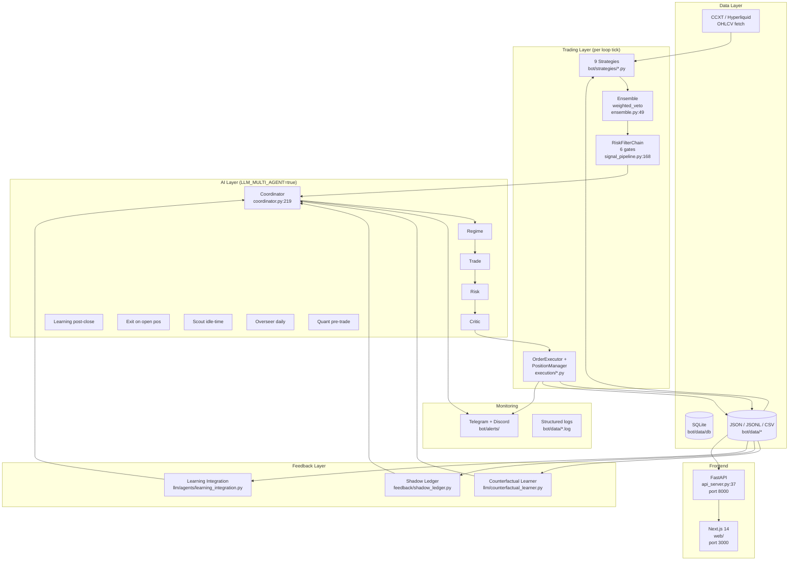
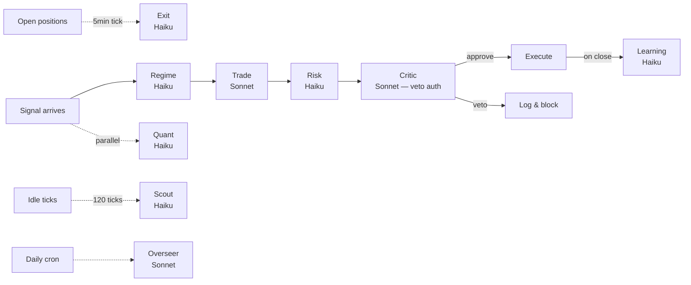

# WAGMI System Architecture

**Onboarding doc for new contributors.** Describes the system as it actually runs today (2026-04-17), not the long-term plan. If you can read this end-to-end you should be able to land a PR.

---

## 1. System Overview

WAGMI is an autonomous crypto trading bot for Hyperliquid. A signal pipeline produces candidate trades, a 6-stage safety chain filters them, an optional 9-agent LLM specialist pipeline reasons over each survivor, and an executor places orders. Closed trades feed three feedback systems (counterfactuals, shadow ledger, learning agent) that mutate per-symbol weights and graduate hypotheses into rules. A FastAPI server (`bot/api_server.py`) exposes everything to a Next.js dashboard. A second 6-agent "swarm" runs offline daily and proposes config tweaks.



---

## 2. Trading Layer

### 2.1 Signal generation

9 strategies live in `bot/strategies/`. Each implements `evaluate(symbol, ohlcv) -> Optional[Signal]`. Signal contract is in `bot/strategies/base.py` (Signal dataclass, `is_valid` property requires stop ≥ 0.3% of entry, R:R ≥ 1.0, SL/TP on correct side).

Active strategies (registered in `multi_strategy_main.py` startup):

| Strategy | File | Timeframes |
|---|---|---|
| Regime Trend | `regime_trend.py` | 1h, 6h |
| Monte Carlo Zones | `monte_carlo_zones.py` | daily |
| Confidence Scorer | `confidence_scorer.py` | varies |
| Multi-Tier Quality | `multi_tier_quality.py` | 5m, 1h |
| Bollinger Squeeze | `bollinger_squeeze.py` | 1h |
| Mean Reversion | `mean_reversion.py` | 1h |
| Funding Rate | `funding_rate.py` | funding window |
| OI Divergence | `oi_divergence.py` | 5m + OI |
| VMC Cipher | `vmc_cipher.py` | 1h |

Support modules (not vote-producing strategies): `chop_detector.py`, `regime_detector.py`, `lead_lag.py`, `cross_symbol_patterns.py`, `liquidation_cascade.py`, `probability_engine.py`.

### 2.2 Ensemble voting

`bot/strategies/ensemble.py:49` (`EnsembleStrategy`). Default mode: `weighted_veto`. Per-strategy weights live in `bot/data/strategy_weights.py` (rolling EMA over recent PnL — note: was poisoned by WR metric until 2026-04-12, see `WR_POISONING_FIX` memory). `evaluate()` at line 360.

Quality gates applied inside ensemble (NOT in the chain — applied first):

1. Volume chop filter (skip if volume < 50% of 20-bar avg)
2. Min `n_agree` strategies on same side (configurable, default 1 per `feedback_no_gates_until_100_trades` policy)
3. Min 65% confidence after merge
4. Multi-TF trend consensus (`_check_timeframe_alignment` at line 155)
5. Per-symbol regime gate (`_get_regime_allowed_strategies` at line 341)

### 2.3 Safety gate chain (6 stages)

`bot/core/signal_pipeline.py:168` (`RiskFilterChain.evaluate` at line 217). A signal must pass all six in order:

1. **Validity** — `Signal.is_valid` (R:R, stop width, side correctness)
2. **Circuit breaker** — `bot/execution/risk.py` (daily loss cap, consecutive-loss streak)
3. **Position limits** — max open per symbol / cluster
4. **Leverage decision** — `bot/execution/leverage.py`
5. **Liquidation safety** — distance from liq price > buffer
6. **Portfolio risk** — `bot/execution/portfolio_risk_budget.py`

A second class `SafetyFilterChain` (line 1281) is the LLM-first variant — fewer gates, more deference to the agent layer. Choice between them is dispatched via `LLM_FIRST_MODE` env flag.

### 2.4 Position manager + execution

- `bot/execution/position_manager.py:185` (`PositionManager`). State machine: `IDLE → OPEN → TP1_HIT → TRAILING → CLOSED`. Backed by `bot/data/position_state.json` + `position_backup.json`.
- `bot/execution/order_executor.py` — places orders via CCXT.
- `bot/execution/leverage.py` — Kelly-fraction leverage (full Kelly per `feedback_full_kelly_approach` memory; previous 25% cap removed).
- `bot/execution/reconciliation.py` — startup state reconcile against exchange (currently broken — see Known Issues §9).
- `bot/execution/ops_guard.py` — duplicate-position detection (currently leaky — see §9).
- `bot/execution/mfe_exit.py`, `dynamic_tp.py`, `tp_sl_engine.py` — exit-side smarts.
- `bot/manual/runner.py` + `bot/manual/sniper_filter.py` — manual sniper system (target $20-50/day, 5-20x leverage scalps; `auto_execute=False` per current state).

---

## 3. AI Layer

### 3.1 Core 9-agent specialist pipeline

Orchestrated by `bot/llm/agents/coordinator.py:219` (`AgentCoordinator`). Enable with `LLM_MULTI_AGENT=true`. Entry point: `get_trading_decision()` at line 253. Per-agent prompts in `bot/llm/agents/prompts.py`.



| Agent | Model | One-liner | Code entry |
|---|---|---|---|
| Regime | Haiku | Classifies market regime + directional bias | `coordinator.py:253` (start of pipeline) |
| Trade | Sonnet | Forms thesis, decides go/skip/flip with confluence scoring | inside `get_trading_decision` |
| Risk | Haiku | Kelly sizing + portfolio risk flags | inside `get_trading_decision` |
| Critic | Sonnet | Veto authority — must produce counter-thesis | inside `get_trading_decision` |
| Learning | Haiku | Post-close lesson extraction (currently unlogged — see §9) | `get_post_trade_lesson` line 1562 |
| Exit | Haiku | Re-evaluate open positions every 5 ticks | `get_exit_intelligence` line 1793 |
| Scout | Haiku | Idle-time watchlists + lead-lag alerts | `run_scout` line 1896 |
| Overseer | Sonnet | Daily system audits + meta-decisions | `run_overseer` line 1974 |
| Quant | Haiku | Statistical edge validation | `quant_engine.py` |

All agents speak the **shared vocabulary** (`bot/llm/agents/shared_context.py`) and emit JSON following the **OBSERVE→RECALL→REASON→DECIDE→JUSTIFY** thought protocol (`bot/llm/agents/thought_protocol.py`). Cross-agent contradictions are surfaced by `bot/llm/agents/consistency_checker.py`.

### 3.2 Shared memory bus

A pipeline-scoped scratchpad (`bot/llm/agents/reasoning_scratchpad.py`) lets downstream agents read upstream conclusions. Regime writes its classification → Trade reads it and writes its thesis → Risk reads both and writes the size → Critic reads everything and either approves or vetoes with evidence.

### 3.3 6-agent offline swarm optimizer

`bot/llm/agents/swarm_master.py:23` (`SwarmMaster`). Runs daily at 00:00 UTC. Audits the past 7 days of single-signal trades, fans out to 6 specialists, ranks recommendations by `impact × confidence`, and writes config patches under `bot/data/feedback/swarm/`.

Agents: **Entry Optimizer**, **Exit Specialist**, **Sizing Specialist**, **Regime Tuner**, **Pattern Discoverer**, **Multi-Signal Comparator**. Prompts in `bot/llm/agents/swarm_agent_prompts.py`. Backfilled measurement loop in `bot/feedback/swarm_feedback_loop.py`.

### 3.4 Cost router

`bot/llm/usage_tiers.py` maps trigger → model:

| Trigger | Model | $/call |
|---|---|---|
| `PRE_TRADE` | Opus | 0.015 |
| `REGIME_SHIFT`, `HIGH_CONFIDENCE` | Sonnet | 0.003 |
| `POSITION_CLOSED`, `PERIODIC`, `MEMORY_EVENT` | Haiku | 0.0001 |

Override globally with `LLM_USAGE_TIER=CONSERVATIVE|RECOMMENDED|AGGRESSIVE|UNLEASHED`. Per-agent override with `AGENT_<NAME>_MODEL=...`. Spend tracked in `bot/data/llm/cost_tracker.json` via `bot/llm/cost_tracker.py`.

### 3.5 Calibration stack

- Per-agent calibration curves: `bot/data/llm/calibration_curve.json` (Brier deltas).
- Agent performance log: `bot/data/llm/agent_performance.jsonl`.
- Calibration ledger: `bot/data/llm/calibration_ledger.json` (built by `bot/llm/agents/calibration_ledger.py`).
- Confidence calibrator: `bot/llm/confidence_calibrator.py` re-buckets confidences using historical hit rates.
- Slash commands: `/confidence-calibrate`, `/prompt-calibrate`, `/agent-consistency`.

---

## 4. Feedback Layer

Three independent loops all converge on the LLM context that the next pipeline tick sees.

### 4.1 Counterfactual tracking

`bot/llm/counterfactual_learner.py:125` (`CounterfactualLearner`). On every skip the bot records what *would* have happened: pending records in `bot/data/llm/counterfactual_pending.jsonl`, resolved when price crosses TP/SL into `counterfactual_resolved.jsonl`. Surfaced via `/v1/counterfactuals/resolved` and the funnel-cost endpoint (`/v1/signals/funnel/cost`).

### 4.2 Shadow ledger

`bot/feedback/shadow_ledger.py:41` (`ShadowLedger`). For each *blocked* signal, records the gate that killed it + the hypothetical PnL. Used by `bot/feedback/auto_optimizer.py` to propose gate-loosening when block-cost exceeds N% of equity. Storage: `bot/data/counterfactuals/scenarios.json`.

### 4.3 Learning loop

- `bot/llm/agents/learning_integration.py` wires Learning-agent output into the deep memory + hypothesis stream. **CURRENTLY BROKEN** — coordinator never calls `record_pipeline_run` for the Learning agent (see §9 + `DEAD_AGENTS_2026_04_17.md`).
- `bot/llm/deep_memory.py` writes structured trade DNA to `bot/data/llm/deep_memory/`.
- `bot/llm/growth/` — hypothesis tracker, knowledge distillation, recommendation queue.

### 4.4 Knowledge graduation

`bot/data/llm/graduated_rules.json` is the "promoted to canon" file. A hypothesis becomes a rule once it has ≥ N samples, > T win rate, and the consistency checker doesn't flag it. Slash command: `/knowledge-distill`.

**Current brokenness flag**: graduation pipeline is silent because the Learning agent isn't logging (§9). Hypotheses queue in `bot/data/llm/growth/` but never get the closing-trade evidence needed to promote.

---

## 5. Frontend Layer

### 5.1 Next.js app (`web/`)

Next.js 14.2 + React 18 + TypeScript + Framer Motion + Lightweight Charts + SWR. Dark theme (`#050508` bg, `#00cc88` accent). Run with `cd web && npm run dev` (port 3000). 18 pages compile as of tonight.

Pages (`web/pages/`):

| Page | Purpose | API endpoints used |
|---|---|---|
| `index.tsx` | Landing — hero metrics, market pulse | `/v1/summary`, `/v1/signals`, `/v1/activity/feed` |
| `dashboard.tsx` | Trader cockpit | `/v1/summary`, `/v1/positions`, `/v1/trades/history` |
| `signals.tsx` | Live signal funnel + recent signals | `/v1/signals/funnel`, `/v1/signals/funnel/cost` |
| `backtest.tsx` | Run picker + per-run detail | `/v1/backtest/runs`, `/v1/backtest/results/{id}` |
| `results.tsx` | Latest backtest summary | `/v1/backtest/results/latest` |
| `performance.tsx` | 7d/30d/lifetime metrics | `/v1/performance/metrics` |
| `agent-intelligence.tsx` | 9-agent health strip + per-agent drill-down | `/v1/agents/health`, `/v1/agents/{name}/performance`, `/v1/agents/{name}/calibration` |
| `ai-decisions.tsx` | LLM decision feed | `/v1/llm/feed`, `/v1/llm/market-view` |
| `reasoning.tsx` | Agent-chain viewer per pipeline | `/v1/reasoning/feed`, `/v1/reasoning/pipeline/{id}` |
| `forensics.tsx` | Worst trades + loss clusters | `/v1/forensics/analysis` |
| `counterfactuals.tsx` | Skipped signals + missed PnL | `/v1/counterfactuals/resolved` |
| `copy-trade.tsx` | Sniper / mechanical copy state | `/v1/copy/status`, `/v1/sniper/recent` |
| `portfolio.tsx` | Allocation + correlation warnings | `/v1/portfolio/allocation` |
| `strategies/*` | Per-strategy stats | `/v1/strategies` |
| `llm-audit.tsx` | Cost / token spend | (stub — pulls from `agents/overview` for now) |
| `learn.tsx`, `masterclass.tsx` | Educational content | static |

### 5.2 Components shipped tonight

`web/components/`: `AgentBrainGraphic`, `AgentChain`, `AgentDetailModal`, `AgentHealthStrip`, `DecisionTrail`, `EquityTicker`, `LiveActivityTape`, `MarketPulse`, `MetricSparkline`, `PositionCard`, `ProofStrip`, `ReasoningTeaser`, `ScanningEmptyState`, `Shimmer`, `SignalFunnel`, `Signals`, `SniperAlerts`, `SystemStatus`, plus `Layout`, `Sidebar`, `Icon`, `ErrorBoundary`. Charts in `components/charts/`: `EquityCurve`, `DrawdownChart`, `BarChart`, `DonutChart`, `Heatmap`, `PerformanceHeatmap`, `Sparkline`, `TradingChart`.

### 5.3 API server (`bot/api_server.py`)

FastAPI + uvicorn on port 8000. CORS open. Reads directly from `bot/data/` files — **no Postgres, no in-memory state**, every request is a fresh disk read except the 30s `/v1/signals` cache. 33 endpoints (full list: `bot/data/sessions/API_REFERENCE_2026_04_18.md`). Run with `cd bot && python api_server.py`.

### 5.4 WAGMI-native differentiators

Built tonight — none of these exist in standard trading dashboards:

- **Reasoning feed** (`/reasoning`): every trade decision has a clickable chain showing each agent's OBSERVE/REASON/DECIDE blocks with model badges and latency. Unique to multi-agent systems.
- **Counterfactual ledger** (`/counterfactuals`): "signals you skipped that would have won" + the gate that killed them. Surfaces missed PnL.
- **Signal funnel cost overlay** (`/signals` hover): shows aggregated hypothetical PnL killed at each funnel stage. Quantifies the cost of every gate.
- **Agent health strip**: 9-agent live/stale/dead status at a glance, refreshed against `agent_performance.jsonl`.
- **Decision trail per trade** (`/v1/trade/{id}/trail`): given a closed trade, finds the originating agent pipeline + lesson note.

---

## 6. Data Layer

### 6.1 Live data ingest

- `bot/data/fetcher.py` + `bot/data/fetchers/` — multi-exchange OHLCV via CCXT (Hyperliquid primary).
- Retry with exponential backoff is required (rule). Fetch staleness threshold: 5 min.

### 6.2 Persistent stores

| Path | Format | Purpose |
|---|---|---|
| `bot/data/db.py` (SQLite) | `bot/data/wagmi.db` | Signal rejections, schema in `bot/data/migrations.py` |
| `bot/data/trades.csv` | CSV | Append-only closed-trade ledger (132 rows current) |
| `bot/data/position_state.json` | JSON | Live PositionManager state |
| `bot/data/risk_equity_state.json` | JSON | Equity + peak-equity (drives CB %) |
| `bot/data/portfolio_risk/correlation_cache.json` | JSON | Cross-symbol correlation matrix |
| `bot/data/feedback/*.json` | JSON | Per-system state (adaptive risk, sizer, tuner, regime, signal quality) |
| `bot/data/counterfactuals/scenarios.json` | JSON | Shadow ledger entries |

### 6.3 LLM stores

| Path | Purpose |
|---|---|
| `bot/data/llm/decisions.jsonl` | Append-only agent decision log (drives `/v1/reasoning/*`) |
| `bot/data/llm/agent_performance.jsonl` | Per-agent call records (drives health strip) |
| `bot/data/llm/llm_memory.json` | Short-term memory, 100 notes, 7-day TTL |
| `bot/data/llm/deep_memory/` | Long-term: trade DNA, patterns, hypotheses, lessons |
| `bot/data/llm/calibration_curve.json` + `calibration_ledger.json` | Calibration evidence per agent |
| `bot/data/llm/cost_tracker.json` | Daily/total token spend by model |
| `bot/data/llm/counterfactual_pending.jsonl` / `_resolved.jsonl` | Counterfactual ledger |
| `bot/data/llm/graduated_rules.json` | Hypotheses promoted to rules |
| `bot/data/llm/growth/` | Active learning, hypothesis queue |
| `bot/data/llm/teaching/knowledge_base.json` | Self-teaching curriculum state |
| `bot/data/llm/mechanical_bot_state/` & `_memory/` | Sniper auto-executor (currently dormant) |

Rule: never truncate `decisions.jsonl` in production — it is the audit trail. Memory write failures must degrade gracefully.

---

## 7. Monitoring Layer

### 7.1 Today

- `bot/alerts/telegram_bot.py` + `bot/alerts/router.py` — Telegram alerts with formatting in `bot/alerts/tg_format.py`. Premium signals via `bot/alerts/premium_telegram.py` + `premium_filter.py`.
- `bot/alerts/enhanced_telegram.py` — operator commands (`/status`, `/positions`, etc.).
- Discord fallback: `bot/alerts/router.py` (low-urgency firehose).
- Logs: `bot/data/bot_session_*.log` (per-session), structured logging via `bot/core/structured_logging.py`.
- Pipeline telemetry: `bot/core/pipeline_telemetry.py`.

### 7.2 Plan (designed, not built)

`bot/data/sessions/OBSERVABILITY_PLAN_2026_04_17.md` is the design doc for a `bot/observability/metrics.py` aggregator + a `GET /metrics` endpoint. Catalogs ~40 metrics across trading health, LLM health, signal pipeline, execution, and safety, with healthy/unhealthy thresholds and Telegram alert priorities. Key design points: Telegram-first, specific thresholds (no vibes), failure-of-monitoring is itself an alert, suppression on remediation. Not yet implemented — `metrics.py` does not exist.

---

## 8. Critical Path: A Signal End-to-End

**Trace: BTC 1h bar closes → ensemble → gates → LLM → execution → close → learning.**

```mermaid
sequenceDiagram
    participant CCXT
    participant Loop as multi_strategy_main loop
    participant Strats as 4-9 Strategies
    participant Ens as EnsembleStrategy
    participant Chain as RiskFilterChain
    participant Coord as AgentCoordinator
    participant Exec as PositionManager
    participant Files as bot/data/*
    participant FB as Feedback systems

    CCXT->>Loop: OHLCV update (BTC 1h close)
    Loop->>Strats: each.evaluate(symbol, ohlcv)
    Strats->>Ens: 9 candidate Signals (or None)
    Ens->>Ens: weighted_veto + chop + TF align (line 360)
    Ens->>Chain: surviving Signal
    Chain->>Chain: 6 gates (signal_pipeline.py:217)
    Chain-->>FB: rejection -> shadow_ledger
    Chain-->>FB: rejection -> counterfactual_pending
    Chain->>Coord: approved Signal
    Coord->>Coord: Regime -> Trade -> Risk -> Critic
    Coord-->>Files: write decisions.jsonl + agent_performance.jsonl
    Coord-->>Files: write scratchpad
    Coord->>Exec: approved decision (Critic vote)
    Exec->>CCXT: place order
    Exec->>Files: position_state.json (OPEN)
    Note over Exec: ... time passes ...
    Exec->>Coord: Exit agent every 5 ticks (get_exit_intelligence:1793)
    Exec->>Files: position_state.json (TP1_HIT/TRAILING)
    Exec->>Files: trades.csv on close
    Exec->>FB: counterfactual_resolved (price crossed levels)
    Files->>Coord: get_post_trade_lesson (line 1562)
    Coord->>Files: deep_memory + lessons.jsonl (BROKEN — see §9)
```

Step-by-step:

1. **Bar close** — CCXT poller in `bot/data/fetcher.py` updates the in-memory candle buffer.
2. **Strategy fan-out** — each strategy's `evaluate()` runs; missing TFs → returns None gracefully.
3. **Ensemble merge** — `EnsembleStrategy.evaluate()` (`ensemble.py:360`) collects the candidates, runs the 5 quality gates, returns merged Signal or None.
4. **Risk chain** — `RiskFilterChain.evaluate()` (`signal_pipeline.py:217`) runs the 6 safety gates; rejections fork into the shadow ledger and counterfactual pending log.
5. **LLM pipeline** — if `LLM_MULTI_AGENT=true`, `AgentCoordinator.get_trading_decision()` (`coordinator.py:253`) runs Regime → Trade → Risk → Critic. Each call appends to `decisions.jsonl` + `agent_performance.jsonl`. Critic veto kills the trade with logged counter-thesis.
6. **Execution** — `OrderExecutor.open_position()` places the order; `PositionManager.open_position()` (`position_manager.py:321`) tracks state.
7. **Live management** — every 5 ticks (~5 min) the Exit agent re-evaluates open positions (`coordinator.py:1793`); tighter trails come from `mfe_exit.py` + `dynamic_tp.py`.
8. **Close** — TP/SL hit → `PositionManager` transitions to CLOSED, appends a row to `trades.csv`, settles fees.
9. **Counterfactual resolution** — `CounterfactualLearner.update_with_price` flips matching pending records into `counterfactual_resolved.jsonl`.
10. **Learning** — `coordinator.get_post_trade_lesson()` (line 1562) calls the Learning agent. *This is where the chain currently breaks — the coordinator returns the lesson but never records it to the performance tracker, so /trade-postmortem and graduation see nothing. See §9.*

---

## 9. Known Issues / Tech Debt

Cited from tonight's audit set under `bot/data/sessions/*_2026_04_17.md`:

| ID | File | Issue | Source |
|---|---|---|---|
| **9.1 Sub-0.3% stops in production** | `bot/strategies/base.py` validates `is_valid` but 49 trades exited with stop < 0.3% (`-$111`) | SL is being shrunk post-validation (likely `dynamic_tp.py`) or sniper bypasses `is_valid`. | `BUG_AUDIT_2026_04_17.md` §1, §2a |
| **9.2 Sniper init log says `max_lev=25.0x`** | `bot_session_20260416d.log:25` reports 25x, but `bot/manual/config.py:77` set 5x | Either the log string is stale or the cap doesn't bind at order time. Sniper auto-exec safely off until verified. | `BUG_AUDIT` §1.2 |
| **9.3 LLM 76% API error rate** | 387/617 recent calls in `decisions.jsonl` are `api_status_400 (credit_balance_too_low)` | All Critic vetoes, Exit reassessments, Scout scans returning empty. Coordinator falls back to rule-based. | `BUG_AUDIT` §1.3 + `LLM_QUALITY_2026_04_17.md` |
| **9.4 4 dead agents** | Learning, Exit, Scout, Overseer have **0** records in `agent_performance.jsonl` over 11,606 entries | Coordinator calls `_call_agent` for these but never invokes `_tracker.record_pipeline_run`. Learning + Exit fixes are 5-line patches. | `DEAD_AGENTS_2026_04_17.md` (full RCA + ranked patches) |
| **9.5 Ghost positions** | `RECONCILE failed to fetch positions from Hyperliquid: requires user parameter` — every bot start | Reconcile path can't query exchange state; recovery is local-file-only. Crash-mid-trade = drift. | `BUG_AUDIT` §1 + `BUGS_FOUND.md` BUG-003 |
| **9.6 Duplicate-entry bug** | 7 pairs of identical-price back-to-back trades, including a triple BTC SHORT @ 68373.7 inside 75 min ($-32) | `core/signal_pipeline.py` position-dup check leaks; not just sniper. Total damage ~$-46 across 14 trades. | `BUG_AUDIT` §2b |
| **9.7 Fee bug** | trades.csv `fees` column zero on 26 anticipatory trades despite +$62 PnL | Sniper/anticipatory path skips fee accrual on the close-write — accounting only, not real money. | `BUG_AUDIT` §2c |
| **9.8 LONG-only direction bias** | Since 2026-04-08: HYPE 18 LONG / 0 SHORT, ETH 16 LONG / 0 SHORT | Likely Critic veto-bias on shorts in current regime — investigate Critic prompt + per-side calibration. | `BUG_AUDIT` §2d, `SHORT_EDGE_INVESTIGATION_2026_04_17.md` |
| **9.9 Observability not implemented** | `bot/observability/metrics.py` does not exist; `/metrics` endpoint missing | Design doc only (`OBSERVABILITY_PLAN_2026_04_17.md`). Silent failures are the dominant failure mode right now. | `OBSERVABILITY_PLAN_2026_04_17.md` |
| **9.10 Reconcile vs reality** | Stale `position_backup.json` re-blocked 104 phantom positions on restart | Reconcile fix (9.5) blocks resolution of this one. | `BUG_AUDIT` §1 (DUPLICATE BLOCKED counts) |
| **9.11 Strategy weight WR-poisoning regression risk** | `feedback/parameter_tuner.py` and 14 other files were patched 2026-04-12 to use PnL not WR | Any new feedback file added since must follow PnL contract or it'll re-introduce the bug. | `wr_poisoning_fix_2026_04_12` memory, `KNOWLEDGE_AUDIT_2026_04_17.md` |
| **9.12 LLM_MODE=0 but Scout/Overseer still attempt calls** | Adds noise to error stream | Per-agent gate is missing the LLM_MODE check before `_call_agent`. | `BUG_AUDIT` Finding 5 |

---

## Appendix: Key Commands

```bash
# Run paper trading
cd bot && python run.py paper

# One-shot signal scan
cd bot && python run.py signals

# API server (for frontend)
cd bot && python api_server.py     # port 8000

# Frontend
cd web && npm run dev               # port 3000

# Tests
cd bot && pytest tests/             # full suite (~2,300 tests)
cd bot && pytest tests/ -k "agent"  # agent-only

# Daily skills (slash commands in Claude Code)
/health-check, /paper-status, /signal-check, /agent-debug, /trade-postmortem
/edge-finder, /loss-autopsy, /pnl-maximize, /veto-review
```

## Appendix: Env Vars That Matter

```
ANTHROPIC_API_KEY         # required for LLM
LLM_MULTI_AGENT=true      # turn the 9-agent pipeline on
LLM_USAGE_TIER=RECOMMENDED
LLM_MODE=4                # 0=OFF, 5=FULL autonomy
LLM_FIRST_MODE=true       # use SafetyFilterChain instead of RiskFilterChain
ENVIRONMENT=paper         # paper|production
SNIPER_AUTO_EXECUTE=false # currently false — see issue 9.2
AGENT_<NAME>_MODEL=...    # per-agent override
AGENT_<NAME>_ENABLED=true # per-agent on/off
```

---

**Last updated**: 2026-04-17. If something here is wrong, the truth is in the code — start from the file:line citations.
